# FitConnect: Fitness Training & Scheduling Platform

FitConnect is an all-in-one platform connecting users with personal trainers and fitness programs. It offers intuitive scheduling, subscription management, and progress tracking to help users achieve their fitness goals. Admins and instructors are also empowered with robust tools to manage sessions, users, and revenue.

🚀 **Deployed site**: [FitConnect (Live Demo)](https://fitconnectog-e095aee33185.herokuapp.com)

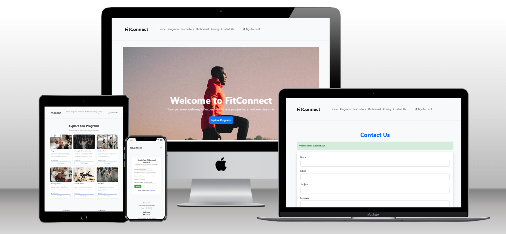

---

# 📋 Table of Contents

- [Goals](#goals)
  - [External User Goals](#external-user-goals)
  - [Site Owner Goals](#site-owner-goals)
- [User Experience (UX)](#user-experience-ux)
  - [ERD](#erd)
  - [Wireframes](#wireframes)
  - [User Stories](#user-stories)
- [Features](#features)
  - [Existing Features](#existing-features)
  - [Future Features](#future-features)
- [Site Structure](#site-structure)
- [Technologies Used](#technologies-used)
- [Testing](#testing)
- [Deployment](#deployment)
- [Credits](#credits)

---

# 🎯 Goals

## External User Goals
- Register, log in, and manage their fitness profile.
- Book sessions, track progress, and communicate with instructors.
- Manage subscriptions and view personalized dashboards.

## Site Owner Goals
- Provide a user-friendly system for managing users, bookings, and payments.
- Empower instructors to handle schedules and feedback.
- Streamline admin functions for growth and scalability.

---

# 💡 User Experience (UX)

## ERD

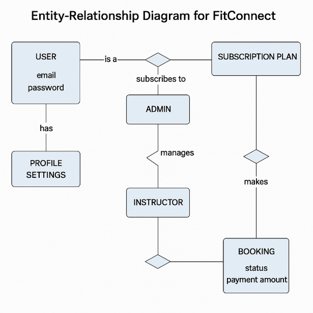

## Wireframes

The wireframes were created with [Balsamiq](https://balsamiq.cloud/sihiecx/p9ewmui/r2278) for desktop and mobile devices.

* ### Home Page


* ### Programs Page
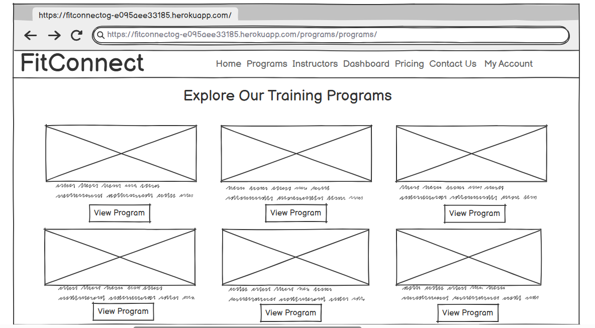

* ### Instructors Details Page
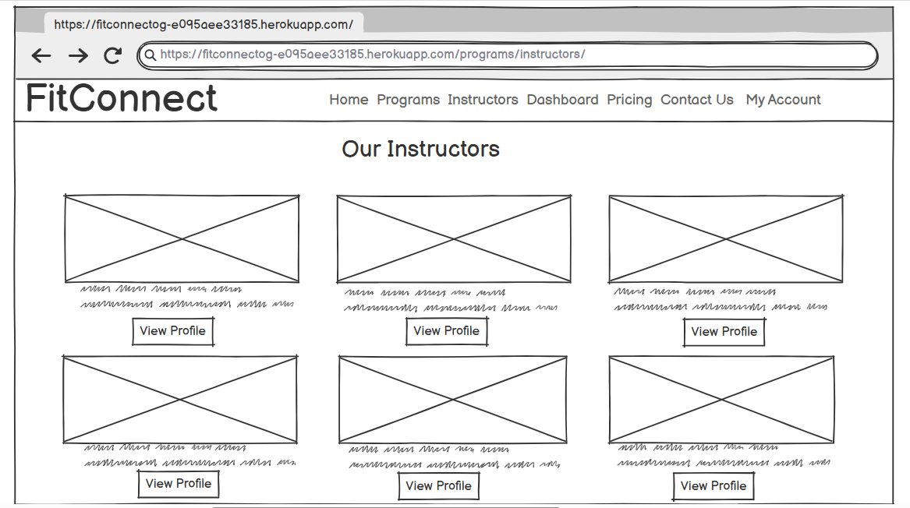

* ### Dashboard Page
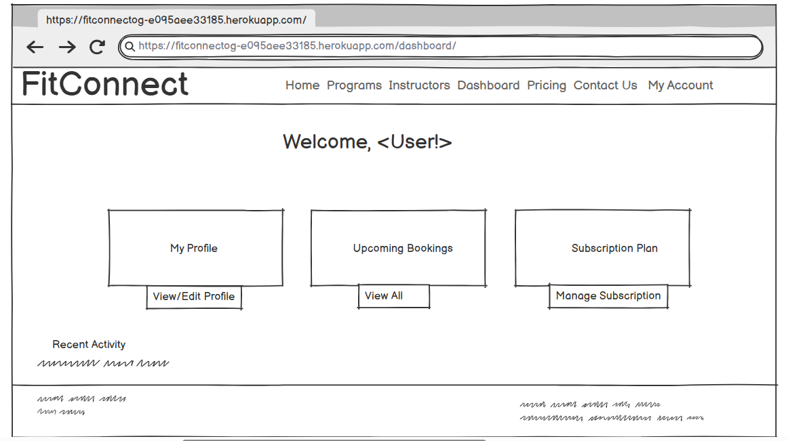

* ### Pricing Details Page
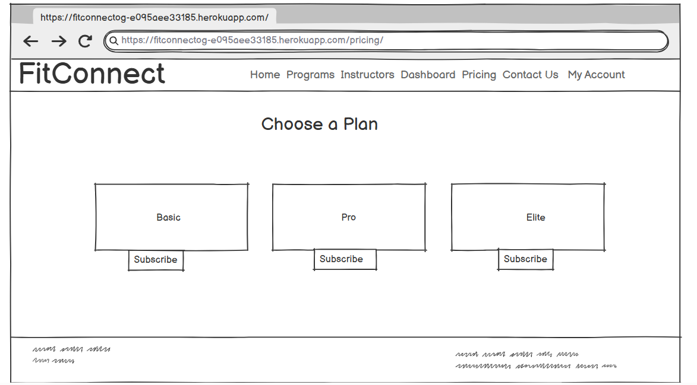

* ### Contact Us Page
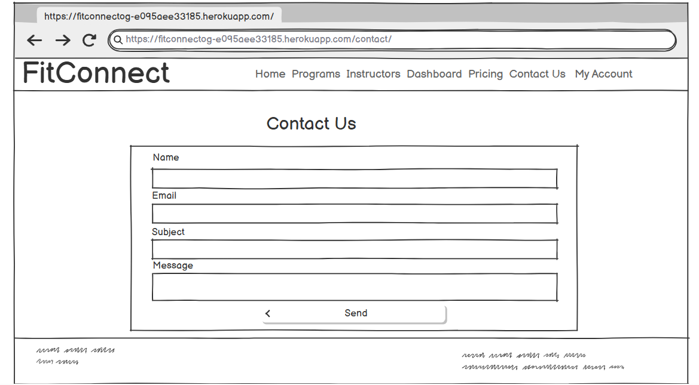

---
[Back to top](#table-of-contents)

# ✅ User Stories

FitConnect was built using Agile methodology. Below is a list of user stories tracked via GitHub Issues.

### 👤 General Users
- **#2 Registration & Profile Setup**
- **#5 Book a Training Session**
- **#6 Cancel a Booking**
- **#7 View Instructor Profiles**
- **#8 Leave Reviews and Feedback**
- **#9 User Dashboard**
- **#17 Manage Profile Settings**
- **#16 Track Fitness Progress**

### 🔐 Authentication
- **#2 User Registration and Profile Setup**
- **#2 User Login/Logout**

### 💼 Admins
- **#3 Admin Adds Instructor**
- **#12 Admin Role: Manage Users and Instructors**
- **#14 Admin: Monitor Bookings and Payments**

### 💳 Payments
- **#10 Payment and Subscription Integration**
- **#11 Manage Subscription Plans**

### 🧑‍🏫 Instructors
- **#13 Instructor Scheduling**

### 🔔 Other
- **#15 Send Notifications**

# Detailed User Stories

## 🔐 User Story: User Registration and Login
As a user, I want to register and log into my FitConnect account so that I can manage my fitness experience.

✅ Acceptance Criteria:
Users can register with a unique email and secure password.

Users can log in and log out.

Authenticated users are redirected to the homepage.

Errors are shown for invalid credentials.

## 💼 User Story: Manage Profile Settings
As a user, I want to update my personal information so that my profile stays current.

✅ Acceptance Criteria:
Users can edit name, and other personal info.

Changes are saved and reflected immediately.

## 🏋️ User Story: Book a Training Session
As a user, I want to book a fitness class or session so that I can train with an instructor.

✅ Acceptance Criteria:
Available sessions are listed with date, time, and instructor info.

Users can book a spot with one click.

Confirmations are sent via email or shown on-screen.

## 📋 User Story: Browse Training Programs
As a user, I want to browse all available classes and instructors so that I can choose what suits me.

✅ Acceptance Criteria:
A directory of classes and instructors is visible.

Non-logged-in users can view but not book.

## 👤 User Story: View Instructor Profiles
As a user, I want to see the qualifications of instructors so that I can pick the right one.

✅ Acceptance Criteria:
Instructor bios, specialties, and availability are visible.

Profiles show average ratings or reviews if available.

## 💬 User Story: Leave Reviews and Feedback
As a user, I want to leave feedback for instructors so that others can benefit from my experience.

✅ Acceptance Criteria:
Reviews include rating, text, and timestamp.

Feedback can be updated or deleted by the user.

## 🧾 User Story: Manage Subscription Plans
As a user, I want to view and subscribe to plans so that I can access premium features.

✅ Acceptance Criteria:
Pricing and features of each plan are clearly listed.

Users can upgrade, downgrade, or cancel a subscription.

Payment integration with Stripe/PayPal.

💸 User Story: Payment and Subscription Integration
As a user, I want to securely pay for subscriptions so that I can unlock full access.

✅ Acceptance Criteria:
Users can add and manage payment methods.

Payments are processed securely.

## 📉 User Story: Admin - Monitor Bookings and Payments
As an admin, I want to track all system bookings and financials so that I can report and maintain integrity.

✅ Acceptance Criteria:
Admin dashboard displays total bookings, revenue, and active plans.

Payment logs and booking stats are exportable.

Each user story includes clear acceptance criteria and is available in the [GitHub Issues](https://github.com/HazelHawadi/FitConnect/issues) section.

---

# ✨ Features

## Existing Features

- **User Authentication** – Secure registration and login system.
- **Instructor Profiles** – View background, ratings, and programs offered.
- **Booking System** – Real-time calendar-based booking and cancellation.
- **Dashboard** – Central hub for user profile(view/edit), bookings, and subscriptions.
- **Notifications** – Email or in-app notifications.
- **Reviews** – Leave feedback on instructors and training programs.
- **Subscription Management** – Choose and manage fitness plans.
- **Admin Tools** – Monitor metrics, manage users/instructors, and process payments.

## Future Features

- **Video Training Integration** – Embedded live or recorded sessions.
- **Fitness Challenges** – Community-based fitness goals.
- **Mobile App** – Native mobile application for iOS and Android.
- **Progress Tracking** – Log goals, view history and training stats.
- **AI Coach Recommendations** – Personalized fitness suggestions.

---
# Site Structure
The FitConnect platform is designed to provide users with a smooth and interactive experience for discovering fitness programs, booking training sessions, tracking progress, and managing subscriptions and profiles. Below is a detailed outline of the site structure, aligned with the site's navigation and functionality.

### Homepage

- The homepage acts as the main entry point for visitors and users. It highlights key features of FitConnect, showcases featured fitness programs and instructors, and provides quick links to explore offerings or log in.

### User Authentication

- Users can easily register, log in, and log out. Upon successful login, users are redirected to the homepage. The authentication system ensures user security and smooth access to booking and subscription features.

### Programs

- Users can browse a variety of fitness programs, view detailed descriptions, pricing, and view details. Programs are categorized by difficulty level and can be selected during the session booking process.

### Instructors

- Visitors and users can view detailed instructor profiles, specialties and user reviews. This section helps users choose the right trainer for their fitness journey.

### Dashboard

- The Dashboard offers a personalized view for each user. From here, users can manageview/update their profile, view subscription status, recent activities, upcoming bookings. Admins and instructors have additional controls based on their role.

### Pricing

- The Pricing page outlines different subscription plans, including features, durations, and payment options. Users can subscribe to a plan and manage their billing from this section.

### Contact Us

- Users and visitors can reach out via the Contact Us form for questions, issues, or support. Upon submission, they receive success or error feedback, and the message is sent to FitConnect’s admin team via email.

### My Profile

- Each user has a profile page showing their personal and fitness-related information. Users can update details such as name, phone number and contact details. Changes are saved instantly and reflected throughout the platform.

[Back to top](#table-of-contents)

# 🧰 Technologies Used

- **Languages**: Python, JavaScript, HTML5, CSS3
- **Frameworks**: Django, Bootstrap
- **Databases**: Amazon, PostgreSQL (Heroku/CI hosted)
- **Authentication**: Django Allauth
- **Deployment**: Heroku, GitHub
- **Other Tools**: Cloudinary, Stripe API, EmailJS, Google Calendar API

---

# ✅ Testing

- Functional testing performed on all key workflows:
  - Booking, login/logout, subscription
  - Profile management, cancellation, instructor search
- Manual device/browser testing for responsiveness
- Accessibility audit using Lighthouse

### Css


* ### Home Page
    - Desktop Test


    - Mobile Test
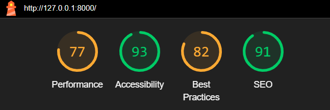

* ### Programs Page
    - Desktop Test
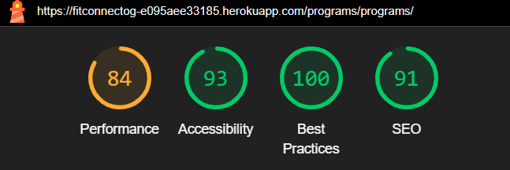

    - Mobile Test
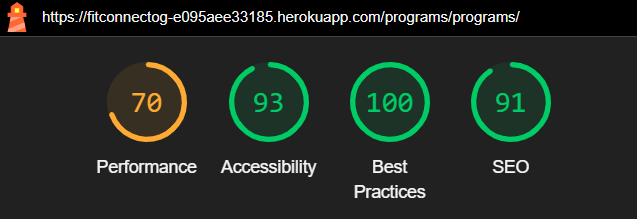

* ### Instructors Details Page
    - Desktop Test
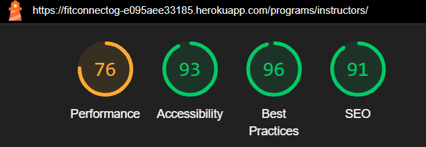

    - Mobile Test


* ### Dashboard Page
    - Desktop Test


    - Mobile Test
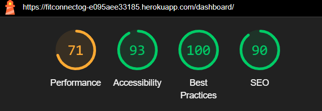

* ### Pricing Details Page
    - Desktop Test
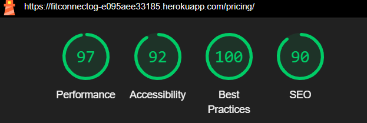

    - Mobile Test


* ### Contact Us Page
    - Desktop Test
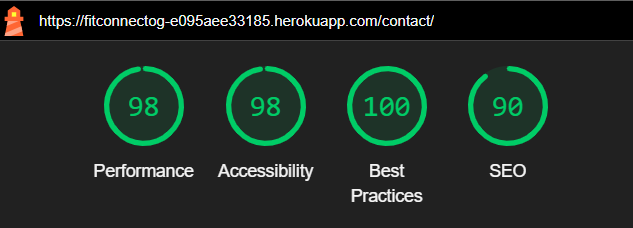

    - Mobile Test
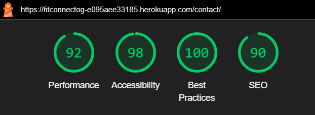

* ### Profile Page
    - Desktop Test
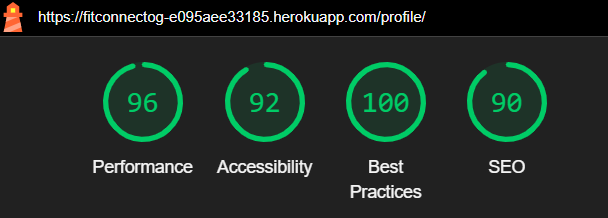

    - Mobile Test

---

# 🚀 Deployment

For good practice, this project was deployed early to [Heroku](https://www.heroku.com) in order to save time and avoid nasty surprises later on.

After installing Django and the supporting libraries, the basic Django project was created and migrated to the database. 

The database provided by Django [db.sqlite3](https://docs.python.org/3/library/sqlite3.html) is only accessible within the workspace environment. In order for Heroku to be able to access the database, a new database suitable for production needs to be created.  Heroku offers a postgres add-on at an extra charge. I am using a postgreSQL database instance hosted on [CI Database](https://dbs.ci-dbs.net/) as this service is free. 

<details>
<summary>Steps taken before deploying the project to Heroku</summary>

### Create the Heroku App

1. Login to Heroku and click on the top right button ‘New’ on the dashboard. 
2. Click ‘Create new app’.
3. Give your app a unique name and select the region closest to you. 
4. Click on the ‘Create app’ button.

### Create the PostgreSQL Database

1. Login to https://dbs.ci-dbs.net/.
2. step 1: enter your email address and submit.  
3. step 2: creates a database.  
4. step 3: receive the database link on your email id. 

### Create the env.py file

With the database created, it now needs to be connected with the project.  Certain variables need to be kept private and should not be published to GitHub.  

1. In order to keep these variables hidden, it is important to create an env.py file and add it to .gitignore.  
2. At the top **import os** and set the DATABASE_URL variable using the `os.environ` method. Add the URL copied from instance created above to it, like so:
`os.environ[“DATABASE_URL”] = ”copiedURL”`
3. The Django application requires a SECRET_KEY to encrypt session cookies.  Set this variable to any string you like or generate a secret key on this [MiniWebTool](https://miniwebtool.com/django-secret-key-generator/).
`os.environ[“SECRET_KEY”] = ”longSecretString”`

### Modify settings.py 

It is important to make the Django project aware of the env.py file and to connect the workspace to the new database. 

1. Open up the settings.py file and add the following code. The if statement acts as a safety net for the application in case it is run without the env.py file.
```
import os
import dj_database_url

env_path = BASE_DIR / '.env'
if env_path.exists():
    load_dotenv(dotenv_path=env_path)
```
2. Remove the insecure secret key provided by Django and reference the variable set in the env.py file earlier, like so:
```
SECRET_KEY = os.environ.get(‘SECRET_KEY’)
```
3. Hook up the database using the dj_database_url import added above.  The original DATABASES variable provided by Django connects the Django application to the created db.sqlite3 database within your repo.  This database is not suitable for production so comment out the existing db.sqlite3 and include the command as below for the new database. 

```
# Database
# https://docs.djangoproject.com/en/5.0/ref/settings/#databases

# DATABASES = {
#   'default': {
#       'ENGINE': 'django.db.backends.sqlite3',
#       'NAME': BASE_DIR / 'db.sqlite3',
#   }
# }

DATABASES = {
    'default': dj_database_url.parse(os.environ.get("DATABASE_URL"))
}
```

**NOTE**: If at the start of the development you are using the local db.sqlite3, make sure to add it to the .gitignore file, so as not to make the mistake of pushing it to your repository.  

5. Save and migrate this database structure to the newly connected postgreSQL database.  Run the migrate command in your terminal
`python3 manage.py migrate`

### Connect the Database to Heroku

1. Open up the Heroku dashboard, select the project’s app and click on the ‘Settings’ tab.
2. Click on ‘Reveal Config Vars’ and add the DATABASE_URL with the value of the copied URL from the database instance created on CI database.
3. Also add the SECRET_KEY with the value of the secret key added to the env.py file. 
4. If using gitpod another key needs to be added in order for the deployment to succeed.  This is PORT with the value of 8000.

### Setup the Templates Directory

In settings.py, add the following under BASE_DIR 
`DIRS = os.path.join(BASE_DIR, "templates")`

### Add the Heroku Host Name

In settings.py scroll to ALLOWED_HOSTS and add the Heroku host name.  This should be the Heroku app name created earlier followed by `.herokuapp.com`.  Add in `’localhost’` so that it can be run locally.
```
ALLOWED_HOSTS = [‘heroku-app-name.herokuapp.com’, ‘localhost’]
```

### Create the Directories and the Process File

1. Create the media, static and templates directories at the top level next to the manage.py file. 
2. At the same level create a new file called ‘Procfile’ with a capital ‘P’.  This tells Heroku how to run this project.  
3. Add the following code, including the name of your project directory. 
```
web: gunicorn fitconnect.wsgi
```
* ‘web’ tells Heroku that this a process that should accept HTTP traffic.
* ‘gunicorn’ is the server used.
* ‘wsgi’, stands for web services gateway interface and is a standard that allows Python services to integrate with web servers.
4. Save everything and push to GitHub. 

</details>

<details>
<summary>First Deployment</summary>

### First Deployment

1. Go back to the Heroku dashboard and click on the ‘Deploy’ tab.  
2. For deployment method, select ‘GitHub’ and search for the project’s repository from the list. 
3. Select and then click on ‘Deploy Branch’.  
4. When the build log is complete it should say that the app has been successfully deployed.
5. Click on the ‘Open App’ button to view it and the Django “The install worked successfully!” page, should be displayed. 

</details>

<details>
<summary>Final Deployment</summary>

### Final Deployment

1. When development is complete, if you had left `DEBUG = True` in the settings.py file, make sure to change it to `False`. You don't have to change anything if you had used `DEBUG = 'DEVELOPMENT' in os.environ` as your env.py file is ignored by GitHub. 
2. Commit and push your code to your project's repository.
3. Then open up Heroku, navigate to your project's app. Click on the 'settings' tab, open up the config vars and delete the DISABLE_COLLECTSTATIC variable. 
4. Navigate to the 'Deploy' tab and scroll down to 'Deploy a GitHub branch'.
5. Select the branch you want to deploy and click on the 'Deploy branch' button. When the app is deployed, you should see a message in the built log saying "Your app was successfully deployed".  Click 'View' to see the deployed app in the browser. Alternatively, you can click on the 'Open App' button at the top of the page. 

</details>

_____

### Forking the GitHub Repository

<details>
<summary>Steps to Fork the GitHub Repository</summary>

Forking allows you to view and edit the code without affecting the original repository

1. Locate the GitHub repository. Link to this repository can be found [here](https://github.com/CsClown/bitcoin-buzz).
2. Click on 'Fork', in the top right-hand corner.
3. This will take you to your own repository to a fork with the same name as the original branch.

</details>

_____

### Creating a Local Clone

<details>
<summary>Steps to Creating a Local Clone</summary>

1. Go to the GitHub repository. Link to this repository can be found [here](https://github.com/HazelHawadi/FitConnect.git).
2. Click on 'Code' to the right of the screen. This will open a dropdown. Click on HTTPs and copy the link.
3. Open Git Bash in your IDE and change the current working directory to the location where you want the cloned directory.
4. Type `git clone`, paste the URL you copied earlier, and press Enter to create your local clone.

More information on Creating and Managing repositories can be found [here](https://docs.github.com/en/repositories/creating-and-managing-repositories/cloning-a-repository)
<br>

</details>

[Back to top](#table-of-contents)
---

# 🙌 Credits

- **Project Owner**: Hazel Hawadi  
- **Design Inspiration**: [Dribbble Fitness UI](https://github.com/HazelHawadi/FitConnect.git)
- **Icons**: [Font Awesome](https://fontawesome.com/)
- **Images**: [Unsplash](https://unsplash.com/), [Pexels](https://pexels.com/)
- **Tech Help**: Code Institute Slack Community

---

[Back to top](#table-of-contents)
